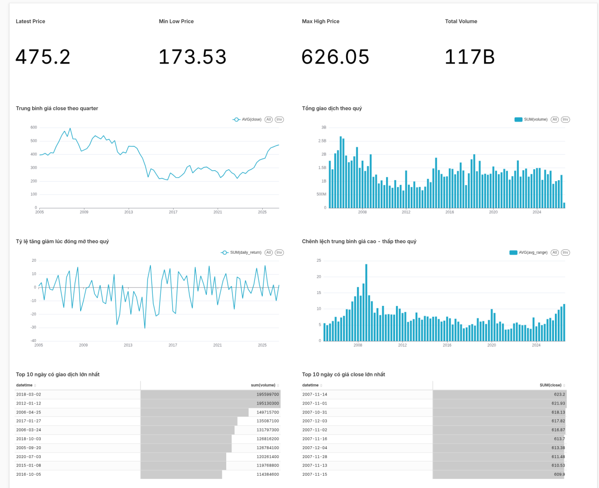

## Project description

    Du an thuc hanh quan ly dlieu stock lam bang python:
    - CRUD API
    - system(docker)
    - auth (JWT)
    - ETL
    - data analysis(find: fromdate --> todate)
    - airflow
## Tech Stack

    - Backend: Python(FastAPI)
    - Database: ClickHouse
    - Container: Docker, Docker Compose
    - Frontend: HTML, JS
    - Authentication: JWT(cookie)
    - Data Visualization : Apache Superset
    - Orchestration : Apache Airflow

## Project Structure

    project/  
        api/
        │    ├── router/stock_router.py  → định nghĩa API endpoints (/login, /stocks...)
        │    ├── main_api.py                 → khởi động FastAPI, gắn router
        │    └── requirements.txt        # thu vien
        │
        app/
        │    ├── views/                  → HTML templates (Jinja2)
        │    │   ├── login.html
        │    │   ├── register.html
        │    │   └── index.html
        │    ├── static/script.js        → JS chạy trên browser
        │    ├── router/stock_router.py  → nhận request từ browser, gọi sang api
        │    ├── main_app.py                 → khởi động FastAPI, gắn router
        │    └── requirements.txt        # thu vien
        │
        business_data/
        │    ├── config/            # ket noi db
        │    ├── etl/      
        │    │      ├── crawler/     # laydlieu
        │    │      ├── transform/   # lam sach
        │    │      ├── load/        # luu vao db
        │    │      └── pipeline.py  #crawler-->transform-->load
        │    ├── untils/                 
        │    │      └── batch_insert.py
        │    ├── schemas/           
        │    ├── models/            # dinh nghia bang
        │    └── services/          # logic: query db,...
        │
        airflow/
        │    └── dags/                 
        │        └── stock_dag.py
        │
        superset/                    
        │   └── dashboards/          
        │
        ├── data/raw/               # dlieu goc 
        ├── dockerfile.app/         # cach build app
        ├── dockerfile.api/         # cach build api
        ├── dockerfile.api/         # cach build api
        ├── docker-compose.yml      # he thong
        └── .env.example/           # bien moi truong

## Features

    ### 1.CRUD API
    ### 2.Authentication(JWT)
        + Register User
        + Login User
        + Tao JWT token
        + Luu vao cookie
        + Het han token
    ### 3.Data Analysis
        + query stock: fromDate --> toDate
    ### 4.Docker System
        + Container he thong
        + chay dong bo API + Database
    ### 5.ETL
        + lay db--> lam sach--> luu vao db
    ### 6.Orchestration & BI Dashboard:
        + Airflow: Điều phối lịch chạy tự động cho luồng ETL theo khung giờ thị trường
        + Apache Superset: Trực quan hóa dữ liệu qua biểu đồ tương tác, theo dõi biến động giá thực tế.
            

## WorkFlow

    Frontend (FastAPI render Jinja)
            ↓
    Backend API (FastAPI /api)
            ↓
    Business layer (business_data)
            ↓
    ClickHouse / DB
            ↑
           Load
            ↑
        Transform
            ↑
        Crawler

## Installation

    ### 1. Clone project
            git clone https://github.com/nqvinh-08/stockPY.git
            cd stockPY
    ### 2. Cau hinh env
    ### 3. Cach chay etl
            python -m business_data.etl.pipeline

    #### Cach chay bang docker:

        ### 1. Run with Docker
            docker compose up --build
            docker compose up -d --build(chay nen)
        ### 2.Stop with Docker
            docker compose down

    #### Cach chay local:
        ### 1. Install dependencies
            pip install -r requirements.txt
        ### 2. Setup virtual environment
            python3 -m venv venv
            source venv/bin/activate (join venv)
        ### 3. lenh chay:
            uvicorn main_app:app --host 0.0.0.0 --port 8000 

    ####Các cổng truy cập dịch vụ (Endpoints):
        Web App Frontend: http://localhost:8000
        Backend API Docs (Swagger): http://localhost:8001/docs
        Apache Airflow UI: http://localhost:8080
        Apache Superset BI: http://localhost:8088
    

